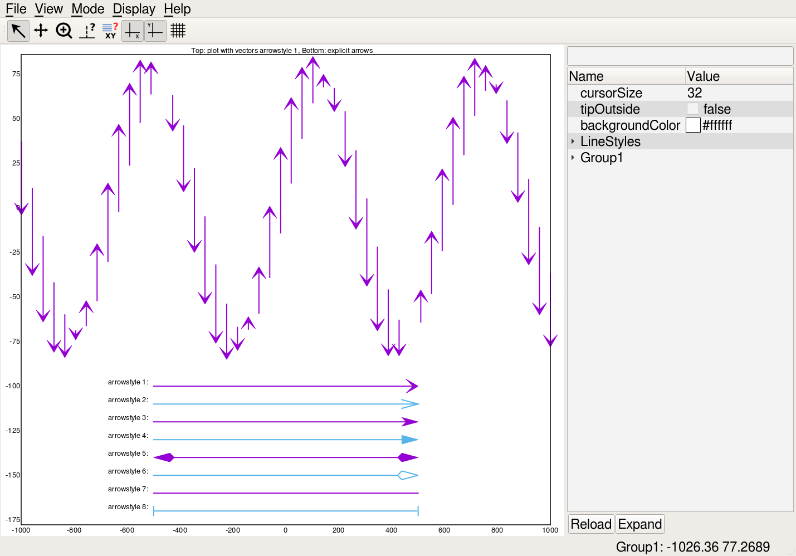

# CQGnuPlot

This application provides a _gnuplot_ like plotting application.

The application aims to be a rough emulation of gnuplot to research
plotting functionality and possibly spin off a more modern version
which has more interactivity and better command line syntax.

Currently supports Qt and SVG output devices with interactive support
for many plot elements in the Qt Interface.

## Plotting Details

Plots are generated from text or binary data files where each line represents a set of data
samples at a point and each set of lines represents the plot data.

All sample values or a selection of sample values can be used for each plot point.

